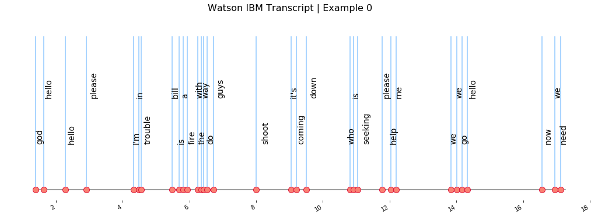
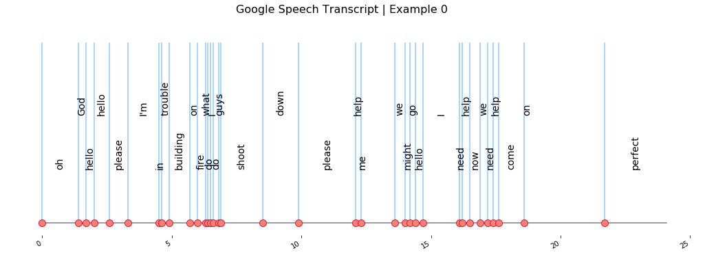
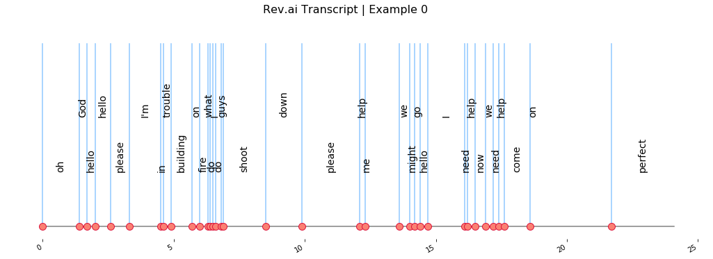

# (Dis)AsTeR - Speech-to-text Service

This submodule specifically implements the Speech-to-Text API as we need it. The current micro-service is integrated on the web through a *Cloud Foundry Python Application*, which gives us some flexibility regarding network architecture. Ultimately, this service is the first one to be used after an emergency call is received, and will be plugged to the micro-service *service_NLP* to determine its priority / keywords. 

## Clound Foundry Application

```bash
cf api https://api.ng.bluemix.net
cf auth xxx xxx
cf push
cf logs serviceSTT --recent
```


## API Usage

```python
from service_STT.commander import Commander

cfg = {'url': 'https://servicestt-appreciative-swan.mybluemix.net/run'}
cmd = Commander('calls/call_0.wav', config=cfg)
txt = cmd.get_transcript(api_type='IBM')
```

There are two main entities in this folder: the endpoint + API structure, which is to be handled through the Cloud Foundry instance; the _commander.py_ script, which gives an upper-layer to the user to easily plug it. Different services are used to transform speech-to-text: 'IBM' (for the [IBM Watson](https://www.ibm.com/watson/services/speech-to-text)), 'GGC' (for the [Google API](https://cloud.google.com/speech-to-text/)) and 'Rev' (for [Rev.ai](https://www.rev.ai)).

## Example

That same integrated _commander.py_ gives you a way to display the obtained transcript:



